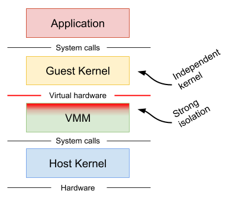

# gVisor

gVisor is a user-space kernel, written in Go, that implements a substantial
portion of the Linux system surface. It includes an [Open Container Initiative
(OCI)][oci] runtime called `runsc` that provides an isolation boundary between
the application and the host kernel. The `runsc` runtime integrates with Docker
and Kubernetes, making it simple to run sandboxed containers.

gVisor takes a distinct approach to container sandboxing and makes a different
set of technical trade-offs compared to existing sandbox technologies, thus
providing new tools and ideas for the container security landscape.

### Why does gVisor exist?

Containers are not a [**sandbox**][sandbox]. While containers have
revolutionized how we develop, package, and deploy applications, running
untrusted or potentially malicious code without additional isolation is not a
good idea. The efficiency and performance gains from using a single, shared
kernel also mean that container escape is possible with a single vulnerability.

gVisor is a user-space kernel for containers. It limits the host kernel surface
accessible to the application while still giving the application access to all
the features it expects. Unlike most kernels, gVisor does not assume or require
a fixed set of physical resources; instead, it leverages existing host kernel
functionality and runs as a normal user-space process. In other words, gVisor
implements Linux by way of Linux.

gVisor should not be confused with technologies and tools to harden containers
against external threats, provide additional integrity checks, or limit the
scope of access for a service. One should always be careful about what data is
made available to a container.

### How is gVisor different from other container isolation mechanisms?

Two other approaches are commonly taken to provide stronger isolation than
native containers.

**Machine-level virtualization**, such as [KVM][kvm] and [Xen][xen], exposes
virtualized hardware to a guest kernel via a Virtual Machine Monitor (VMM). This
virtualized hardware is generally enlightened (paravirtualized) and additional
mechanisms can be used to improve the visibility between the guest and host
(e.g. balloon drivers, paravirtualized spinlocks). Running containers in
distinct virtual machines can provide great isolation, compatibility and
performance (though nested virtualization may bring challenges in this area),
but for containers it often requires additional proxies and agents, and may
require a larger resource footprint and slower start-up times.



**Rule-based execution**, such as [seccomp][seccomp], [SELinux][selinux] and
[AppArmor][apparmor], allows the specification of a fine-grained security policy
for an application or container. These schemes typically rely on hooks
implemented inside the host kernel to enforce the rules. If the surface can be
made small enough (i.e. a sufficiently complete policy defined), then this is
an excellent way to sandbox applications and maintain native performance.
However, in practice it can be extremely difficult (if not impossible) to
reliably define a policy for arbitrary, previously unknown applications,
making this approach challenging to apply universally.


Rule-based execution is often combined with additional layers for
defense-in-depth.

**gVisor** provides a third isolation mechanism, distinct from those mentioned
above.

gVisor intercepts application system calls and acts as the guest kernel, without
the need for translation through virtualized hardware. gVisor may be thought of
as either a merged guest kernel and VMM, or as seccomp on steroids. This
architecture allows it to provide a flexible resource footprint (i.e. one based
on threads and memory mappings, not fixed guest physical resources) while also
lowering the fixed costs of virtualization. However, this comes at the price of
reduced application compatibility and higher per-system call overhead.


On top of this, gVisor employs rule-based execution to provide defense-in-depth
(details below).

gVisor's approach is similar to [User Mode Linux (UML)][uml], although UML
virtualizes hardware internally and thus provides a fixed resource footprint.

Each of the above approaches may excel in distinct scenarios. For example,
machine-level virtualization will face challenges achieving high density, while
gVisor may provide poor performance for system call heavy workloads.

### Why Go?

gVisor was written in Go in order to avoid security pitfalls that can plague
kernels. With Go, there are strong types, built-in bounds checks, no
uninitialized variables, no use-after-free, no stack overflow, and a built-in
race detector. (The use of Go has its challenges too, and isn't free.)

## Architecture

gVisor intercepts all system calls made by the application, and does the
necessary work to service them. Importantly, gVisor does not simply redirect
application system calls through to the host kernel. Instead, gVisor implements
most kernel primitives (signals, file systems, futexes, pipes, mm, etc.) and has
complete system call handlers built on top of these primitives.

Since gVisor is itself a user-space application, it will make some host system
calls to support its operation, but much like a VMM, it will not allow the
application to directly control the system calls it makes.

### File System Access

In order to provide defense-in-depth and limit the host system surface, the
gVisor container runtime is normally split into two separate processes. First,
the *Sentry* process includes the kernel and is responsible for executing user
code and handling system calls. Second, file system operations that extend beyond
the sandbox (not internal proc or tmp files, pipes, etc.) are sent to a proxy,
called a *Gofer*, via a 9P connection.


The Gofer acts as a file system proxy by opening host files on behalf of the
application, and passing them to the Sentry process, which has no host file
access itself. Furthermore, the Sentry runs in an empty user namespace, and the
system calls made by gVisor to the host are restricted using seccomp filters in
order to provide defense-in-depth.

### Network Access

The Sentry implements its own network stack (also written in Go) called
[netstack][netstack]. All aspects of the network stack are handled inside the
Sentry — including TCP connection state, control messages, and packet assembly —
keeping it isolated from the host network stack. Data link layer packets are
written directly to the virtual device inside the network namespace setup by
Docker or Kubernetes.

A network passthrough mode is also supported, but comes at the cost of reduced
isolation (see below).

### Platforms

The Sentry requires a *platform* to implement basic context switching and memory
mapping functionality. Today, gVisor supports two platforms:

* The **Ptrace** platform uses SYSEMU functionality to execute user code without
  executing host system calls. This platform can run anywhere that `ptrace`
  works (even VMs without nested virtualization).

* The **KVM** platform (experimental) allows the Sentry to act as both guest OS
  and VMM, switching back and forth between the two worlds seamlessly. The KVM
  platform can run on bare-metal or on a VM with nested virtualization enabled.
  While there is no virtualized hardware layer -- the sandbox retains a process
  model -- gVisor leverages virtualization extensions available on modern
  processors in order to improve isolation and performance of address space
  switches.

### Performance

There are several factors influencing performance. The platform choice has the
largest direct impact that varies depending on the specific workload. There is
no best platform: Ptrace works universally, including on VM instances, but
applications may perform at a fraction of their original levels. Beyond the
platform choice, passthrough modes may be useful for improving perfomance at the
cost of some isolation.

## Installation

These instructions will get you up-and-running sandboxed containers with gVisor
and Docker.

Note that gVisor can only run on x86\_64 Linux 3.17+. In addition, gVisor only
supports x86\_64 binaries inside the sandbox (i.e., it cannot run 32-bit
binaries).

### Download a Nightly Build

The easiest way to get `runsc` is from the
[latest nightly build][runsc-nightly]. After you download the binary, check it
against the SHA512 [checksum file][runsc-nightly-sha].

**It is important to copy this binary to some place that is accessible to all
users**, since `runsc` executes itself as user `nobody` to avoid unnecessary
privileges. The `/usr/local/bin` directory is a good choice.


```
wget https://storage.googleapis.com/gvisor/releases/nightly/latest/runsc
wget https://storage.googleapis.com/gvisor/releases/nightly/latest/runsc.sha512
sha512sum -c runsc.sha512
chmod +x runsc
sudo mv runsc /usr/local/bin
```

### Configuring Docker

Next, configure Docker to use `runsc` by adding a runtime entry to your Docker
configuration (`/etc/docker/daemon.json`). You may have to create this file if
it does not exist. Also, some Docker versions also require you to [specify the
`storage-driver` field][docker-storage-driver].

In the end, the file should look something like:

```
{
    "runtimes": {
        "runsc": {
            "path": "/usr/local/bin/runsc"
        }
    }
}
```

You must restart the Docker daemon after making changes to this file, typically this is done via:

```
sudo systemctl restart docker
```

Now run your container in `runsc`:

```
docker run --runtime=runsc hello-world
```

Terminal support works too:

```
docker run --runtime=runsc -it ubuntu /bin/bash
```

### Kubernetes Support (Experimental)

gVisor can run sandboxed containers in a Kubernetes cluster with cri-o, although
this is not recommended for production environments yet. Follow [these
instructions][cri-o-k8s] to run [cri-o][cri-o] on a node in a Kubernetes
cluster. Build `runsc` and put it on the node, and set it as the
`runtime_untrusted_workload` in `/etc/crio/crio.conf`.

Any Pod without the `io.kubernetes.cri-o.TrustedSandbox` annotation (or with the
annotation set to false) will be run with `runsc`.

Currently, gVisor only supports Pods with a single container (not counting the
ever-present pause container). Support for multiple containers within a single
Pod is coming soon.

## Advanced Usage

### Installing from Source

gVisor currently requires x86\_64 Linux to build.

#### Requirements

Make sure the following dependencies are installed:

* [git][git]
* [Bazel][bazel]
* [Python][python]
* [Docker version 17.09.0 or greater][docker]
* Gold linker (e.g. `binutils-gold` package on Ubuntu)

#### Getting the source

Clone the gVisor repo:

```
git clone https://gvisor.googlesource.com/gvisor gvisor
cd gvisor
```

### Building

Build and install the `runsc` binary.

```
bazel build runsc
sudo cp ./bazel-bin/runsc/linux_amd64_pure_stripped/runsc /usr/local/bin
```


### Testing

The gVisor test suite can be run with Bazel:

```
bazel test ...
```

### Debugging

To enable debug and system call logging, add the `runtimeArgs` below to your
Docker configuration (`/etc/docker/daemon.json`):

```
{
    "runtimes": {
        "runsc": {
            "path": "/usr/local/bin/runsc",
            "runtimeArgs": [
                "--debug-log-dir=/tmp/runsc",
                "--debug",
                "--strace"
            ]
       }
    }
}
```

You may also want to pass `--log-packets` to troubleshoot network problems. Then
restart the Docker daemon:

```
sudo systemctl restart docker
```

Run your container again, and inspect the files under `/tmp/runsc`. The log file
with name `boot` will contain the strace logs from your application, which can
be useful for identifying missing or broken system calls in gVisor.

### Enabling network passthrough

For high-performance networking applications, you may choose to disable the user
space network stack and instead use the host network stack. Note that this mode
decreases the isolation to the host.

Add the following `runtimeArgs` to your Docker configuration
(`/etc/docker/daemon.json`) and restart the Docker daemon:

```
{
    "runtimes": {
        "runsc": {
            "path": "/usr/local/bin/runsc",
            "runtimeArgs": [
                "--network=host"
            ]
       }
    }
}
```

### Selecting a different platform

Depending on hardware and performance characteristics, you may choose to use a
different platform. The Ptrace platform is the default, but the KVM platform may
be specified by passing the `--platform` flag to `runsc` in your Docker
configuration (`/etc/docker/daemon.json`):

```
{
    "runtimes": {
        "runsc": {
            "path": "/usr/local/bin/runsc",
            "runtimeArgs": [
                "--platform=kvm"
            ]
       }
    }
}
```

Then restart the Docker daemon.

## FAQ & Known Issues

### What works?

The following applications/images have been tested:

* golang
* httpd
* java8
* jenkins
* mariadb
* memcached
* mongo
* mysql
* node
* php
* postgres
* prometheus
* python
* redis
* registry
* tomcat
* wordpress

### What doesn't work yet?

The following applications have been tested and may not yet work:

* elasticsearch: Requires unimplemented socket ioctls. See [bug
  #2](https://github.com/google/gvisor/issues/2).
* nginx: Requires `ioctl(FIOASYNC)`, but see workaround in [bug
  #1](https://github.com/google/gvisor/issues/1).

### Will my container work with gVisor?

gVisor implements a large portion of the Linux surface and while we strive to
make it broadly compatible, there are (and always will be) unimplemented
features and bugs. The only real way to know if it will work is to try. If you
find a container that doesn’t work and there is no known issue, please [file a
bug][bug] indicating the full command you used to run the image. Providing the
debug logs is also helpful.

### When I run my container, docker fails with `flag provided but not defined: -console`

You're using an old version of Docker. Refer to the
[Requirements](#requirements) section for the minimum version supported.

### My container runs fine with *runc* but fails with *runsc*.

If you’re having problems running a container with `runsc` it’s most likely due
to a compatibility issue or a missing feature in gVisor. See **Debugging**,
above.

### I can’t see a file copied with `docker cp` or `kubectl cp`.

For performance reasons, gVisor caches directory contents, and therefore it may
not realize a new file was copied to a given directory. To invalidate the cache
and force a refresh, create a file under the directory in question and list the
contents again.

This bug is tracked in [bug #4](https://github.com/google/gvisor/issues/4).

## Technical details

We plan to release a full paper with technical details and will include it
here when available.

## Community

Join the [gvisor-users mailing list][gvisor-users-list] to discuss all things
gVisor.

Sensitive security-related questions and comments can be sent to the private
[gvisor-security mailing list][gvisor-security-list].

## Contributing

See [Contributing.md](CONTRIBUTING.md).

[apparmor]: https://wiki.ubuntu.com/AppArmor
[bazel]: https://bazel.build
[bug]: https://github.com/google/gvisor/issues
[cri-o-k8s]: https://github.com/kubernetes-incubator/cri-o/blob/master/kubernetes.md
[cri-o]: https://github.com/kubernetes-incubator/cri-o
[docker-storage-driver]: https://docs.docker.com/engine/reference/commandline/dockerd/#daemon-storage-driver
[docker]: https://www.docker.com
[git]: https://git-scm.com
[gvisor-security-list]: https://groups.google.com/forum/#!forum/gvisor-security
[gvisor-users-list]: https://groups.google.com/forum/#!forum/gvisor-users
[kvm]: https://www.linux-kvm.org
[netstack]: https://github.com/google/netstack
[oci]: https://www.opencontainers.org
[python]: https://python.org
[runsc-nightly-sha]: https://storage.googleapis.com/gvisor/releases/nightly/latest/runsc.sha512
[runsc-nightly]: https://storage.googleapis.com/gvisor/releases/nightly/latest/runsc
[sandbox]: https://en.wikipedia.org/wiki/Sandbox_(computer_security)
[seccomp]: https://www.kernel.org/doc/Documentation/prctl/seccomp_filter.txt
[selinux]: https://selinuxproject.org
[uml]: http://user-mode-linux.sourceforge.net/
[xen]: https://www.xenproject.org
