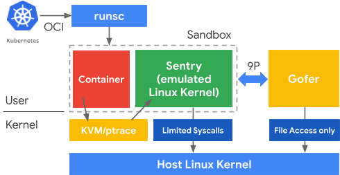
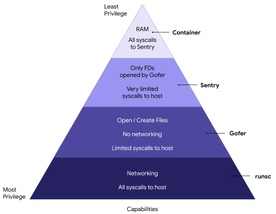
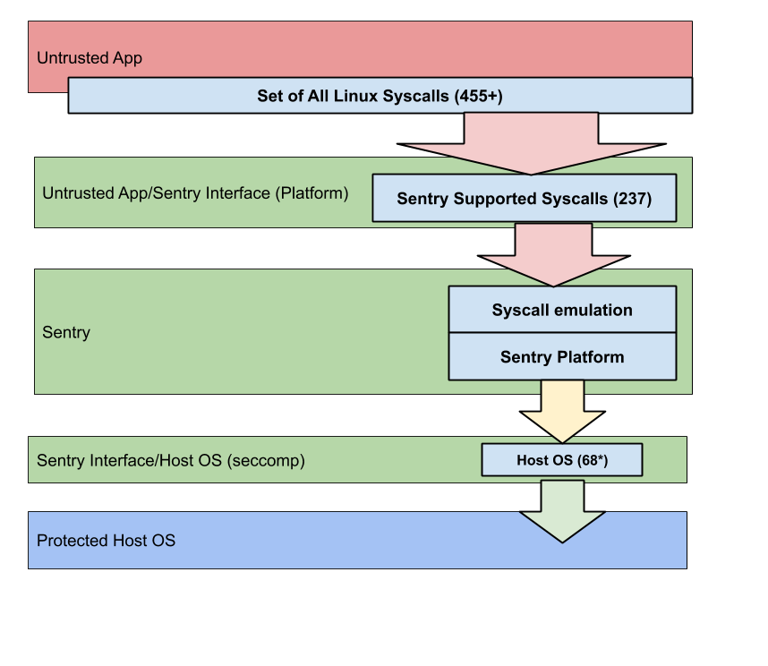

# Part 1 - Introduction

This blog is a space for engineers and community members to share perspectives and deep dives on technology and design within the gVisor project.

Though our logo suggests we’re in the business of space exploration (or perhaps fighting sea monsters), we’re actually in the business of sandboxing Linux containers.

When we created gVisor, we had three specific goals in mind; _container-native security_, _resource efficiency_, and _platform portability_. To put it simply, gVisor provides _efficient defense-in-depth for containers anywhere_.

This post addresses gVisor's _container-native security_, specifically how gVisor provides strong isolation between an application and the host OS. 

Future posts will address _resource efficiency_ (how gVisor preserves container benefits like fast starts, smaller snapshots, and less memory overhead than VMs) and _platform portability_ (run gVisor wherever Linux OCI containers run).  

Delivering on each of these goals requires careful security considerations and a robust design.

## What does “sandbox” mean? 

gVisor allows the execution of untrusted containers, preventing them from adversely affecting the host. This means that the untrusted container is prevented from attacking or spying on either the host kernel or any other peer userspace processes on the host.

For example, if you are a cloud container hosting service, running containers from different customers on the same virtual machine means that compromises expose customer data. Properly configured, gVisor can provide sufficient isolation to allow different customers to run containers on the same host. There are many aspects to the proper configuration, including limiting file and network access, which we will discuss in future posts.

## The cost of compromise

gVisor was designed around the premise that any security boundary could potentially be compromised with enough time and resources. We tried to optimize for a solution that was as costly and time-consuming for an attacker as possible, at every layer.

Consequently, gVisor was built through a combination of intentional design principles and specific technology choices that work together to provide the security isolation needed for running hostile containers on a host. We’ll dig into it in the next section!

# Design Principles

gVisor was designed with some [common secure design principles](https://www.owasp.org/index.php/Security_by_Design_Principles) in mind: Defense-in-Depth, Principle of Least-Privilege, Attack Surface Reduction and Secure-by-Default[^1]. 

In general, Design Principles outline good engineering practices, but in the case of security, they also can be thought of as a set of tactics. In a real-life castle, there is no single defensive feature. Rather, there are many in combination: redundant walls, scattered draw bridges, small bottle-neck entrances, moats, etc.

A simplified version of the design is below ([more detailed version](https://gvisor.dev/docs/architecture_guide/))[^2]:

____ 

Figure 1: Simplified design of gVisor.
____

In order to discuss design principles, the following components are important to know:

*   runsc - binary that packages the Sentry, platform, and Gofer(s) that run containers. runsc is the drop-in binary for running gVisor in Docker and Kubernetes.
*   Untrusted Application - container running in the sandbox. Untrusted application/container are used interchangeably in this article. 
*   Platform Syscall Switcher - intercepts syscalls from the application and passes them to the Sentry with no further handling.
*   Sentry - The "application kernel" in userspace that serves the untrusted application. Each application instance has its own Sentry. The Sentry handles syscalls, routes I/O to gofers, and manages memory and CPU, all in userspace. The Sentry is allowed to make limited, filtered syscalls to the host OS.
*   Gofer - a process that specifically handles different types of I/O for the Sentry (usually disk I/O). Gofers are also allowed to make filtered syscalls to the Host OS.
*   Host OS - the actual OS on which gVisor containers are running, always some flavor of Linux (sorry, Windows/MacOS users).

It is important to emphasize what is being protected from the untrusted application in this diagram: the host OS and other userspace applications.

In this post, we are only discussing security-related features of gVisor, and you might ask, “What about performance, compatibility and stability?” We will cover these considerations in future posts.

## Defense-in-Depth

For gVisor, Defense-in-Depth means each component of the software stack trusts each other component as little as possible.

It may seem strange that we would want our own software components to distrust each other. But by limiting the trust between small, discrete components, each component is forced to defend itself against potentially malicious input. And when you stack these components on top of each other, you can ensure that multiple security barriers must be overcome by an attacker.

And this leads us to how Defense-in-Depth is applied to gVisor: no single vulnerability should compromise the host.

In the “Attacker’s Advantage / Defender’s Dilemma,” the defender must succeed all the time while the attacker only needs to succeed once. Defense in Depth inverts this principle: once the attacker successfully compromises any given software component, they are immediately faced with needing to compromise a subsequent, distinct layer in order to move laterally or acquire more privilege. 

For example, the untrusted container is isolated from the Sentry. The Sentry is isolated from host I/O operations by serving those requests in separate processes called Gofers. And both the untrusted container and its associated Gofers are isolated from the host process that is running the sandbox. 

An additional benefit is that this generally leads to more robust and stable software, forcing interfaces to be strictly defined and tested to ensure all inputs are properly parsed and bounds checked.

## Least-Privilege

The principle of Least-Privilege implies that each software component has only the permissions it needs to function, and no more. 

Least-Privilege is applied throughout gVisor. Each component and more importantly, each interface between the components, is designed so that only the minimum level of permission is required for it to perform its function. Specifically, the closer you are to the untrusted application, the less privilege you have. 

____

Figure 2: runsc components and their privileges.  
____

This is evident in how runsc (the drop in gVisor binary for Docker/Kubernetes) constructs the sandbox. The Sentry has the least privilege possible (it can’t even open a file!). Gofers are only allowed file access, so even if it were compromised, the host network would be unavailable. Only the runsc binary itself has full access to the host OS, and even runsc’s access to the host OS is often limited through capabilities / chroot / namespacing.

Designing a system with Defense-in-Depth and Least-Privilege in mind encourages small, separate, single-purpose components, each with very restricted privileges.

## Attack Surface Reduction

There are no bugs in unwritten code. 

In other words, gVisor supports a feature if and only if it is needed to run host Linux containers. 

### Host Application/Sentry Interface:

There are a lot of things gVisor does not need to do. For example, it does not need to support arbitrary device drivers, nor does it need to support video playback. By not implementing what will not be used, we avoid introducing potential bugs in our code.

That is not to say gVisor has limited functionality! Quite the opposite, we analyzed what is actually needed to run Linux containers and today the Sentry supports 237 syscalls[^3],[^4], along with the range of critical /proc and /dev files. However, gVisor does not support every syscall in the Linux kernel. There are about 350 syscalls[^5] within the 5.3.11 version of the Linux kernel, many of which do not apply to Linux containers that typically host cloud-like workloads. For example, we don't support old versions of epoll (epoll_ctl_old, epoll_wait_old), because they are deprecated in Linux and no supported workloads use them. 

Furthermore, any exploited vulnerabilities in the implemented syscalls (or Sentry code in general) only apply to gaining control of the Sentry. More on this in a later post.

### Sentry/Host OS Interface:

The Sentry’s interactions with the Host OS are restricted in many ways. For instance, no syscall is “passed-through” from the untrusted application to the host OS. All syscalls are intercepted and interpreted. In the case where the Sentry needs to call the Host OS, we severely limit the syscalls that the Sentry itself is allowed to make to the host kernel[^6]. 

For example, there are many file-system based attacks, where manipulation of files or their paths, can lead to compromise of the host[^7]. As a result, the Sentry does not allow any syscall that creates or opens a file descriptor. All file descriptors must be donated to the sandbox.  By disallowing open or creation of file descriptors, we eliminate entire categories of these file-based attacks.

This does not affect functionality though. For example, during startup, runsc will donate FDs the Sentry that allow for mapping STDIN/STDOUT/STDERR to the sandboxed application. Also the Gofer may donate an FD to the Sentry, allowing for direct access to some files. And most files will be remotely accessed through the Gofers, in which case no FDs are donated to the Sentry.

The Sentry itself is only allowed access to specific [whitelisted syscalls](https://github.com/google/gvisor/blob/master/runsc/boot/config.go). Without networking, the Sentry needs 53 host syscalls in order to function, and with networking, it uses an additional 15[^8]. By limiting the whitelist to only these needed syscalls, we radically reduce the amount of host OS attack surface. If any attempts are made to call something outside the whitelist, it is immediately blocked and the sandbox is killed by the Host OS. 

### Sentry/Gofer Interface:

The Sentry communicates with the Gofer through a local unix domain socket (UDS) via a version of the 9P protocol[^9]. The UDS file descriptor is passed to the sandbox during initialization and all communication between the Sentry and Gofer happens via 9P. We will go more into how Gofers work in future posts.

### End Result

So, of the 350 syscalls in the Linux kernel, the Sentry needs to implement only 237 of them to support containers. At most, the Sentry only needs to call 68 of the host Linux syscalls. In other words, with gVisor, applications get the vast majority (and growing) functionality of Linux containers for only 68 possible syscalls to the Host OS. 350 syscalls to 68 is attack surface reduction.

____

Figure 3: Reduction of Attack Surface of the Syscall Table. Note that the Senty's Syscall Emulation Layer keeps the Containerized Process from ever calling the Host OS.
____

## Secure-by-default

The default choice for a user should be safe. If users need to run a less secure configuration of the sandbox for the sake of performance or application compatibility, they must make the choice explicitly.

An example of this might be a networking application that is performance sensitive. Instead of using the safer, Go-based Netstack in the Sentry, the untrusted container can instead use the host Linux networking stack directly. However, this means the untrusted container will be directly interacting with the host, without the safety benefits of the sandbox. It also means that an attack could directly compromise the host through his path.

These less secure configurations are **not** the default. In fact, the user must take action to change the configuration and run in a less secure mode. Additionally, these actions make it very obvious that a less secure configuration is being used.

This can be as simple as forcing a default runtime flag option to the secure option. gVisor does this by always using its internal netstack by default. However, for certain performance sensitive applications, we allow the usage of the host OS networking stack, but it requires the user to actively set a flag[^10].

# Technology Choices

Technology choices for gVisor mainly involve things that will give us a security boundary. 

At a higher level, boundaries in software might be describing a great many things. It may be discussing the boundaries between threads, boundaries between processes, boundaries between CPU privilege levels, and more.

Security boundaries are interfaces that are designed and built so that entire classes of bugs/vulnerabilities are eliminated.

For example, the Sentry and Gofers are implemented using Go. Go was chosen for a number of the features it provided. Go is a fast, statically-typed, compiled language that has efficient multi-threading support, garbage collection and a constrained set of “unsafe” operations.

Using these features enabled safe array and pointer handling. This means entire classes of vulnerabilities were eliminated, such as buffer overflows and use-after-free. 

Another example is our use of very strict syscall switching to ensure that the Sentry is always the first software component that parses and interprets the calls being made by the untrusted container. Here is an instance where different platforms use different solutions, but all of them share this common trait, whether it is through the use of ptrace “a la PTRACE_ATTACH”[^11] or kvm’s ring0[^12].

Finally, one of the most restrictive choices was to use seccomp, to restrict the Sentry from being able to open or create a file descriptor on the host. All file I/O is required to go through Gofers. Preventing the opening or creation of file descriptions eliminates whole categories of bugs around file permissions [like this one](https://cve.mitre.org/cgi-bin/cvename.cgi?name=CVE-2016-4557)[^13]. 

# To be continued - Part 2

In part 2 of this blog post, we will explore gVisor from an attacker’s point of view. We will use it as an opportunity to examine the specific strengths and weaknesses of each gVisor component.

We will also use it to introduce Google’s Vulnerability Reward Program[^14], and other ways the community can contribute to help make gVisor safe, fast and stable.

<!-- Footnotes themselves at the bottom. -->
## Notes

[^1]:
     [https://www.owasp.org/index.php/Security_by_Design_Principles](https://www.owasp.org/index.php/Security_by_Design_Principles)

[^2]:
     [https://gvisor.dev/docs/architecture_guide](https://gvisor.dev/docs/architecture_guide/)

[^3]:
    [ https://github.com/google/gvisor/blob/master/pkg/sentry/syscalls/linux/linux64_amd64.go](https://github.com/google/gvisor/blob/master/pkg/sentry/syscalls/syscalls.go)

[^4]:
     Internally that is, it doesn't call to the Host OS to implement them, in fact that is explicitly disallowed, more on that in the future.

[^5]:
     [https://elixir.bootlin.com/linux/latest/source/arch/x86/entry/syscalls/syscall_64.tbl#L345](https://elixir.bootlin.com/linux/latest/source/arch/x86/entry/syscalls/syscall_64.tbl#L345)

[^6]:
     [https://github.com/google/gvisor/tree/master/runsc/boot/filter](https://github.com/google/gvisor/tree/master/runsc/boot/filter)

[^7]:
     [https://en.wikipedia.org/wiki/Dirty_COW](https://en.wikipedia.org/wiki/Dirty_COW)

[^8]:
    [ https://github.com/google/gvisor/blob/master/runsc/boot/config.go](https://github.com/google/gvisor/blob/master/runsc/boot/config.go)

[^9]:
     [https://en.wikipedia.org/wiki/9P_(protocol)](https://en.wikipedia.org/wiki/9P_(protocol))

[^10]:
    [ https://gvisor.dev/docs/user_guide/networking/#network-passthrough](https://gvisor.dev/docs/user_guide/networking/#network-passthrough)

[^11]:
     [https://github.com/google/gvisor/blob/c7e901f47a09eaac56bd4813227edff016fa6bff/pkg/sentry/platform/ptrace/subprocess.go#L390](https://github.com/google/gvisor/blob/c7e901f47a09eaac56bd4813227edff016fa6bff/pkg/sentry/platform/ptrace/subprocess.go#L390)

[^12]:
    [https://github.com/google/gvisor/blob/c7e901f47a09eaac56bd4813227edff016fa6bff/pkg/sentry/platform/ring0/kernel_amd64.go#L182](https://github.com/google/gvisor/blob/c7e901f47a09eaac56bd4813227edff016fa6bff/pkg/sentry/platform/ring0/kernel_amd64.go#L182)

[^13]:
    [https://cve.mitre.org/cgi-bin/cvename.cgi?name=CVE-2016-4557](https://cve.mitre.org/cgi-bin/cvename.cgi?name=CVE-2016-4557)

[^14]:
    [ https://www.google.com/about/appsecurity/reward-program/index.html](https://www.google.com/about/appsecurity/reward-program/index.html)

