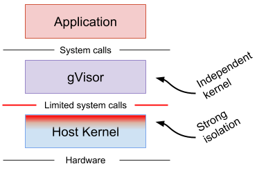

# What is gVisor?

gVisor is an application kernel, written in Go, that implements a substantial
portion of the [Linux system call interface][linux]. It provides an additional
layer of isolation between running applications and the host operating system.

gVisor includes an [Open Container Initiative (OCI)][oci] runtime called `runsc`
that makes it easy to work with existing container tooling. The `runsc` runtime
integrates with Docker and Kubernetes, making it simple to run sandboxed
containers.

gVisor can be used with Docker, Kubernetes, or directly using `runsc`. Use the
links below to see detailed instructions for each of them:

*   [Docker](./user_guide/quick_start/docker.md): The quickest and easiest way
    to get started.
*   [Kubernetes](./user_guide/quick_start/kubernetes.md): Isolate Pods in your
    K8s cluster with gVisor.
*   [OCI Quick Start](./user_guide/quick_start/oci.md): Expert mode. Customize
    gVisor for your environment.

## What does gVisor do?

gVisor provides a virtualized environment in order to sandbox containers. The
system interfaces normally implemented by the host kernel are moved into a
distinct, per-sandbox application kernel in order to minimize the risk of an
container escape exploit. gVisor does not introduce large fixed overheads
however, and still retains a process-like model with respect to resource
utilization.

## How is this different?

Two other approaches are commonly taken to provide stronger isolation than
native containers.

**Machine-level virtualization**, such as [KVM][kvm] and [Xen][xen], exposes
virtualized hardware to a guest kernel via a Virtual Machine Monitor (VMM). This
virtualized hardware is generally enlightened (paravirtualized) and additional
mechanisms can be used to improve the visibility between the guest and host
(e.g. balloon drivers, paravirtualized spinlocks). Running containers in
distinct virtual machines can provide great isolation, compatibility and
performance (though nested virtualization may bring challenges in this area),
but for containers it often requires additional proxies and agents, and may
require a larger resource footprint and slower start-up times.

**Rule-based execution**, such as [seccomp][seccomp], [SELinux][selinux] and
[AppArmor][apparmor], allows the specification of a fine-grained security policy
for an application or container. These schemes typically rely on hooks
implemented inside the host kernel to enforce the rules. If the surface can be
made small enough, then this is an excellent way to sandbox applications and
maintain native performance. However, in practice it can be extremely difficult
(if not impossible) to reliably define a policy for arbitrary, previously
unknown applications, making this approach challenging to apply universally.

Rule-based execution is often combined with additional layers for
defense-in-depth.

**gVisor** provides a third isolation mechanism, distinct from those above.

gVisor intercepts application system calls and acts as the guest kernel, without
the need for translation through virtualized hardware. gVisor may be thought of
as either a merged guest kernel and VMM, or as seccomp on steroids. This
architecture allows it to provide a flexible resource footprint (i.e. one based
on threads and memory mappings, not fixed guest physical resources) while also
lowering the fixed costs of virtualization. However, this comes at the price of
reduced application compatibility and higher per-system call overhead.

On top of this, gVisor employs rule-based execution to provide defense-in-depth
(details below).

gVisor's approach is similar to [User Mode Linux (UML)][uml], although UML
virtualizes hardware internally and thus provides a fixed resource footprint.

Each of the above approaches may excel in distinct scenarios. For example,
machine-level virtualization will face challenges achieving high density, while
gVisor may provide poor performance for system call heavy workloads.

## Why Go?

gVisor is written in [Go][golang] in order to avoid security pitfalls that can
plague kernels. With Go, there are strong types, built-in bounds checks, no
uninitialized variables, no use-after-free, no stack overflow, and a built-in
race detector. However, the use of Go has its challenges, and the runtime often
introduces performance overhead.

## What are the different components?

A gVisor sandbox consists of multiple processes. These processes collectively
comprise an environment in which one or more containers can be run.

Each sandbox has its own isolated instance of:

*   The **Sentry**, which is a kernel that runs the containers and intercepts
    and responds to system calls made by the application.

Each container running in the sandbox has its own isolated instance of:

*   A **Gofer** which provides file system access to the containers.

## What is runsc?

The entrypoint to running a sandboxed container is the `runsc` executable.
`runsc` implements the [Open Container Initiative (OCI)][oci] runtime
specification, which is used by Docker and Kubernetes. This means that OCI
compatible _filesystem bundles_ can be run by `runsc`. Filesystem bundles are
comprised of a `config.json` file containing container configuration, and a root
filesystem for the container. Please see the [OCI runtime spec][runtime-spec]
for more information on filesystem bundles. `runsc` implements multiple commands
that perform various functions such as starting, stopping, listing, and querying
the status of containers.

### Sentry {#sentry}

The Sentry is the largest component of gVisor. It can be thought of as a
application kernel. The Sentry implements all the kernel functionality needed by
the application, including: system calls, signal delivery, memory management and
page faulting logic, the threading model, and more.

When the application makes a system call, the
[Platform](./architecture_guide/platforms.md) redirects the call to the Sentry,
which will do the necessary work to service it. It is important to note that the
Sentry does not pass system calls through to the host kernel. As a userspace
application, the Sentry will make some host system calls to support its
operation, but it does not allow the application to directly control the system
calls it makes. For example, the Sentry is not able to open files directly; file
system operations that extend beyond the sandbox (not internal `/proc` files,
pipes, etc) are sent to the Gofer, described below.

### Gofer {#gofer}

The Gofer is a standard host process which is started with each container and
communicates with the Sentry via the [9P protocol][9p] over a socket or shared
memory channel. The Sentry process is started in a restricted seccomp container
without access to file system resources. The Gofer mediates all access to these
resources, providing an additional level of isolation.

### Application {#application}

The application is a normal Linux binary provided to gVisor in an OCI runtime
bundle. gVisor aims to provide an environment equivalent to Linux v4.4, so
applications should be able to run unmodified. However, gVisor does not
presently implement every system call, `/proc` file, or `/sys` file so some
incompatibilities may occur. See [Compatibility](./user_guide/compatibility.md)
for more information.

[9p]: https://en.wikipedia.org/wiki/9P_(protocol)
[apparmor]: https://wiki.ubuntu.com/AppArmor
[golang]: https://golang.org
[kvm]: https://www.linux-kvm.org
[linux]: https://en.wikipedia.org/wiki/Linux_kernel_interfaces
[oci]: https://www.opencontainers.org
[runtime-spec]: https://github.com/opencontainers/runtime-spec
[seccomp]: https://www.kernel.org/doc/Documentation/prctl/seccomp_filter.txt
[selinux]: https://selinuxproject.org
[uml]: http://user-mode-linux.sourceforge.net/
[xen]: https://www.xenproject.org
