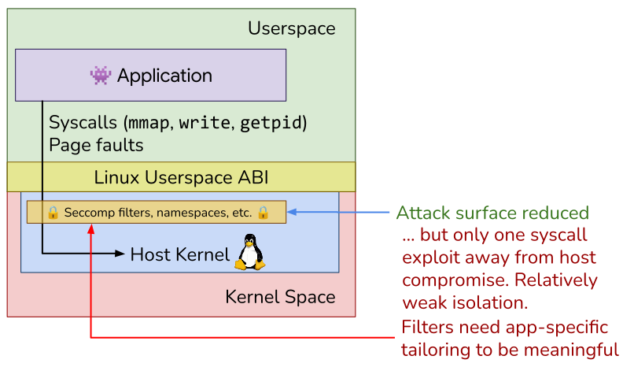
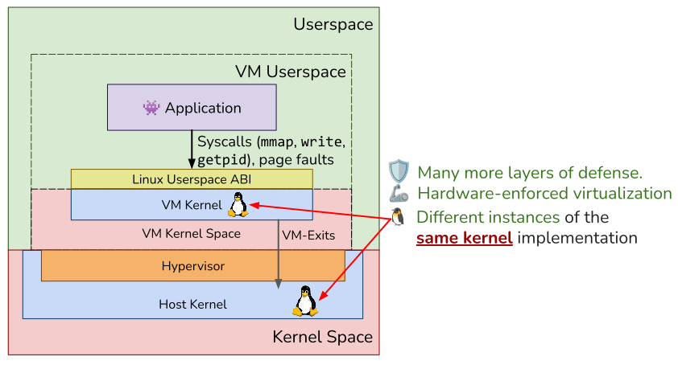
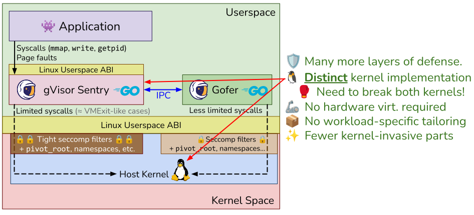

# Introduction to gVisor security

This document is meant to be a high-level introduction to gVisor for security
researchers. It explains how gVisor differs from the way other security products
provide isolation. It assumes a solid understanding of how kernels and operating
systems work.

A look at the [Security Model page](/docs/architecture_guide/security) is also
recommended.

[TOC]

## What is gVisor?

[gVisor](https://gvisor.dev/) is an open-source workload isolation solution to
safely run untrusted code, containers and applications. It
[fundamentally differs](#how-does-gvisor-work) from other isolation solutions in
that it is an application kernel, not a virtual machine hypervisor or a system
call filter.

## How does gVisor work? {#how-does-gvisor-work}

The two most common approaches to sandboxing workloads are to use virtualization
(virtual machines or VMs), and/or Linux kernel security primitives such as
`seccomp-bpf`, Linux namespaces, AppArmor, Landlock, etc. **gVisor uses these
technologies, but not in the standalone way they are typically used**. They are
used for defense-in-depth rather than as a primary layer of defense.

To explain the difference, it is useful to contrast it against these other
approaches first.

### How do Linux kernel security primitives work?



When using Linux kernel security primitives like `seccomp-bpf`, AppArmor,
Landlock, namespaces, and such, the attack surface of the sandboxed applications
is reduced, but that enforcement is still done by the single monolithic Linux
kernel that the sandboxed application can still talk to.

This means the workload is only one system call away from host compromise. The
Linux kernel security primitives help in reducing the surface, but any attack
within that surface (or that undoes the Linux kernel security mechanism itself)
can still be executed. Additionally, these security primitives need to be
carefully configured for the particular workload being sandboxed in order to be
meaningful. For example, system call filters need to be whittled down to the
very set of system calls the workload needs and no others. This also means that
if an application depends on an "unsafe" or broad system call (like `ioctl(2)`
or `io_uring(2)`), it can be very difficult or even impossible to create a
secure set of filters for that application. Additionally, creating a generic
configuration that works for all or most workloads will result in needing to
allow all or most of the kernel surface to be exposed.

While gVisor leverages `seccomp-bpf` and namespaces to minimize its own surface
to the host kernel, it does so only as a second layer of defense, and not in a
way that requires workload-specific tailoring in order to be meaningful.

### How does virtualization work?



When using virtual machines, a hypervisor (which can run in userspace or
kernelspace or both; in the diagram below, it is shown in kernelspace but the
principle applies without loss of generality) manages the coordination between
two kernels: one running on the host as normal, and another running inside a
hardware-enforced virtual machine where the sandboxed workload's activity is
contained.

The virtual machine acts as a strong security boundary that restricts the
application from accessing any host resource. The only way out of the virtual
machine is through a "VM exit", an event triggered only in certain circumstances
and handled by the hypervisor. While virtual machines are the gold standard of
workload isolation, they come at a steep cost in terms of resource overhead and
efficiency, due to the need to pre-allocate machine resources to each virtual
machine on each host and to boot a full, separate Linux kernel.

While gVisor can use virtualization (specifically: KVM), it can also work
without virtualization while maintaining a high level of security.

### How does gVisor provide isolation?



Now that we've seen how Linux kernel security primitives and virtual machines
work, let's turn to gVisor.

**gVisor acts as an application kernel**, but **runs in userspace**. This means
it takes the role that a kernel would from the perspective of a sandboxed
workload, while gVisor itself otherwise acts as a regular user application from
the host kernel's perspective. Like a kernel, gVisor intercepts and handles
system calls and page faults from the sandboxed workload. This handling logic
happens entirely within gVisor code, written in memory-safe Go. This kernel-like
component is called the "gVisor Sentry".

Like a user application, the gVisor Sentry *may* make limited system calls to
the host Linux kernel. It does so when it determines that servicing the
sandboxed workload's request requires information from the host machine and that
the sandboxed workload was initially configured to allow such access.

This means **the gVisor Sentry needs to re-implement Linux in Go**. The gVisor
Sentry contains a Go-based, from-scratch reimplementation of the Linux system
call interface, memory management, filesystems, a network stack, process
management, signal handling, namespaces, etc. **gVisor never passes through any
system call to the host**. Therefore, if a kernel feature isn't reimplemented in
gVisor, then the sandboxed workload cannot use it.

Let's walk through an example. Say a sandboxed process calls `getpid(2)`. gVisor
intercepts this system call. gVisor keeps track of its own PID table
representing the processes in the sandbox. These are not real host processes!
Running `top(1)` on the host will not show them. gVisor uses its own PID table
to find the PID of the sandboxed process, and returns that. From its
perspective, the sandboxed process just ran `getpid(2)`, yet no host system call
was made.

Some system calls made by a sandboxed process may result in one or more host
system calls being made. As a second example, if a sandboxed process wishes to
`read(2)` from a unix `pipe(2)` that another process in the sandbox is
`write(2)`'ing to, the gVisor Sentry (and more specifically, the Go runtime it
relies on) may call the host `futex(2)` system call to perform blocking and
synchronization between these operations. Therefore, the Sentry does need to be
able to perform real system calls, but they do not map 1-to-1 to the system
calls made by the sandboxed processes.

The gVisor Sentry runs in a very restricted environment, leveraging all of the
Linux kernel security primitives available (system call filtering, namespacing,
cgroups, `pivot_root(2)`, etc.). Its system call filter prohibits system calls
like `exec(2)`, `connect(2)`, and their respective variants (with caveats
depending on sandbox configurations). It has an isolated view of the host
filesystem using mount namespaces, and runs as in an isolated user namespace
with minimal capabilities. **This does *not* mean that the sandboxed workload
can't use these system calls; it actually can!** But their logic and
implementation is entirely handled within the gVisor Sentry's kernel logic,
rather than delegating any of it to the host kernel.

For requests that cannot be serviced from within this restricted environment,
there is a sidecar process called the Gofer which is a slightly-more-trusted
companion process running in a slightly-more-privileged context.

This security architecture is similar to virtual machines in that there are two
separate kernels, with the innermost one being exclusive to the sandboxed
workload, and with very restricted access to the host kernel. However, unlike
virtual machines, gVisor sandboxes have the flexibility to allocate and release
host resources (CPU, memory) at runtime, providing better efficiency and
utilization without compromising on the security benefits of the VM-like
dual-kernel security architecture.

Additionally, the gVisor components are all written in memory-safe Go,
eliminating the largest class of security vulnerabilities that would otherwise
be present in a typical VM setup (Linux as guest kernel). In order to break out
of a gVisor sandbox, an attacker would need to simultaneously exploit the gVisor
Sentry kernel *and* the host Linux kernel, which do not share any code.

gVisor contains multiple mechanisms by which it can intercept system calls and
page faults from the sandboxed workload. These are called
"[gVisor platforms](https://gvisor.dev/docs/architecture_guide/platforms/)".
There are currently two supported platforms:

*   "Systrap" (the default). This platform is based on the use of Linux's
    `seccomp-bpf` subsystem for system call ***interception*** (as opposed to
    the typical use-case of `seccomp-bpf` being for system call
    ***filtering***). It does not require virtualization support from the host
    and is therefore well-suited to run *inside* a virtual machine. Read our
    [announcement post for more details on Systrap](https://gvisor.dev/blog/2023/04/28/systrap-release/).
*   "KVM". This platform is based on the use of Linux's KVM subsystem and uses
    virtualization as a means to provide address space isolation and
    interception of page faults. Sandboxed workload code runs in guest ring 3.
    This platform requires virtualization support. It can also work with nested
    virtualization, but is generally slower than Systrap in such a mode.

Platforms are meant to be transparently interchangeable from the system
administrator's perspective. However, they are still different from a security
perspective, as the Linux kernel functionality they rely on to provide system
call and page fault interception differs.

For more information on gVisor security, please see the
[Security Model page](https://gvisor.dev/docs/architecture_guide/security/).

## What does gVisor *not* protect against?

Generally speaking, gVisor protects against Linux kernel exploits by separating
the sandboxed workload from accessing the host kernel directly.

Where gVisor does ***not*** help:

*   Attacks in higher-level components of the stack before the sandbox or
    container runtime even enters the picture, e.g. an exploit in containerd
    that would cause it to start a container without gVisor.
*   Side-channel Spectre-style CPU attacks. gVisor only intercepts system calls
    and page faults, so the application is free to use the CPU as it wants
    (within host cgroup limits), similar to the VM case. Side-channel attacks
    need to be mitigated at the host kernel or hardware level.
*   Exploits *within* the sandboxed workload itself, e.g. a gVisor sandbox
    running nginx and PHP being exploited via an exploit in the PHP code. While
    gVisor *does* help in preventing the attacker from escalating the attack
    further out to the host, the attacker will still have access to whatever the
    sandbox is configured to have access to. In general, this means that
    different customer workloads should be run in different sandboxes to prevent
    a malicious customer from leaking data or exploiting another customer
    workload. Additionally, note that gVisor has a
    [runtime monitoring feature](https://gvisor.dev/docs/user_guide/runtimemonitor/)
    that can be used as an intrusion detection mechanism to detect compromise of
    the sandboxed workload itself.

## How can I test gVisor?

gVisor is available as an [OCI-compliant](https://opencontainers.org/) container
runtime named [runsc](https://gvisor.dev/docs/user_guide/install/). It can be
used with container ecosystem tools like Docker
([gVisor guide](https://gvisor.dev/docs/user_guide/quick_start/docker/)) or
Kubernetes
([gVisor guide](https://gvisor.dev/docs/user_guide/quick_start/kubernetes/)). It
can also be used directly for one-off testing, like this:

```shell
$ sudo runsc do echo Hello world
Hello world
```

Note the use of `sudo`, which may give you pause. It's a sandboxing tool, after
all, shouldn't it run as an unprivileged user? gVisor-sandboxed workloads *do*
run with minimal capabilities in an isolated user namespace from the perspective
of the host kernel. However, the sandbox setup process requires privileges,
specifically for setting up the userspace network stack. Once the sandbox setup
is complete, gVisor re-executes itself and drops all privileges in the process.
This takes place before any untrusted code runs. For sandboxes that don't
require networking, it is possible to run in rootless mode without sudo:

```shell
$ runsc --rootless --network=none do echo Hello world
Hello world
```

How can you tell that gVisor is working? Well, try to do something that involves
the host kernel. For example, you can call `dmesg(1)`, which reads the kernel
logs:

```shell
＃ Without gVisor (unsandboxed):
$ dmesg
dmesg: read kernel buffer failed: Operation not permitted

＃ With gVisor (sandboxed):
$ runsc --rootless --network=none do dmesg
[ 0.000000] Starting gVisor...
[ 0.498943] Waiting for children...
[ 0.972223] Committing treasure map to memory...
[ 1.192981] Segmenting fault lines...
[ 1.591823] Verifying that no non-zero bytes made their way into /dev/zero...
[ 1.787191] Consulting tar man page...
[ 2.083245] Searching for needles in stacks...
[ 2.534575] Forking spaghetti code...
[ 2.742140] Digging up root...
[ 2.921313] Gathering forks...
[ 3.342436] Creating cloned children...
[ 3.511124] Setting up VFS...
[ 3.812459] Setting up FUSE...
[ 4.233037] Ready!
```

This demonstrates that the `dmesg(1)` binary is talking to the gVisor kernel
instead of the host Linux kernel. The humorous messages displayed are part of
gVisor's kernel code when a sandboxed workload asks for kernel logs. These logs
are fictitious and are generated by gVisor's system call handler on demand,
which is why re-running this command will yield different messages. Try to catch
them all!

Note: `runsc do` gives the sandbox read-only access to the host's entire
filesystem by default, as `runsc do` is just a convenience feature to test out
gVisor quickly. In real-world usage, when runsc is used as an OCI container
runtime, host filesystem mappings are strictly defined by the OCI runtime
configuration and gVisor will only expose the paths that the OCI configuration
dictates should be exposed (and will `pivot_root(2)` away from being able to
access any other host directory, for defense in depth). For this reason, when
testing gVisor from a security standpoint, it's better to
[install it as a Docker runtime](https://gvisor.dev/docs/user_guide/quick_start/docker/),
and then use it as follows:

```shell
$ sudo docker run --rm --runtime=runsc -it -v /tmp/vol:/vol ubuntu /bin/bash
```

This will spawn a Bash shell inside a gVisor sandbox, with access to the host
directory `/tmp/vol` mapped to `/vol` inside the sandbox. You can then poke
around within the sandbox and see if you can escape out to the host or glean
information from it (other than the contents of `/tmp/vol`).

## Further reading

*   For more in-depth details on gVisor's security model and architecture, see
    [gVisor Security Model](/docs/architecture_guide/security).
*   For more details on how system call interception works, see
    [gVisor platforms](/docs/architecture_guide/platforms).
*   For guides on how to get started, see
    [Docker Quick Start](/docs/user_guide/quick_start/docker).
