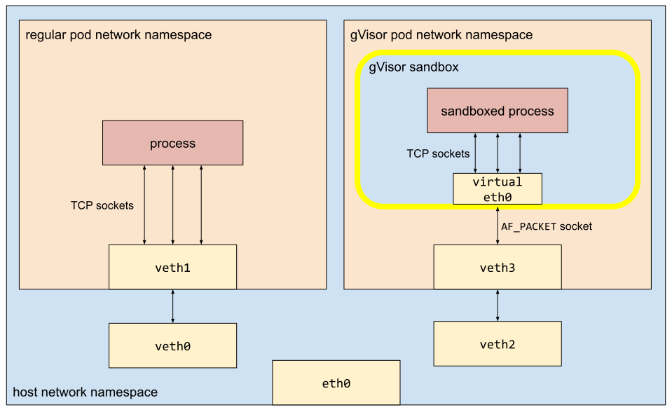

# Networking Guide

[TOC]

Applications running in gVisor often communicate with the outside world. gVisor
networking is architected to enforce a strong isolation boundary without
restricting application behavior. To that end, gVisor implements its own network
stack called **netstack**.

This document describes how packets move to and from gVisor, the architecture of
netstack, and how netstack can be used independently as a userspace network
stack.

## How packets get to and from gVisor

Whether running directly via `runsc` or indirectly through [Docker][docker],
packets flow between gVisor and the host in largely the same manner.

{:style="max-width:100%"}

The gVisor sandbox process (called the *sentry*) is started in a network
namespace with one or more virtual network devices. As with Docker, there is
typically one loopback device and one [VETH device][veth] present. gVisor
scrapes addresses, routes, and the like from those devices and configures the
sentry to use those same addresses and routes. Thus applications in gVisor
accept and generate packets as though they were running on the host **while
still maintaining the strong sandbox boundary.**

The sentry, which for security cannot open host sockets of its own, is
initialized with a single [`AF_PACKET` socket][AF_PACKET]. `AF_PACKET` sockets
send and receive raw packets, i.e. those that include link, network, and
transport headers. gVisor ingresses and egresses all non-loopback traffic across
that socket.

## Netstack architecture

**Threading** in netstack is fairly simple. Link endpoints, the most common of
which is the [fdbased][fdbased] endpoint, spawn their own goroutine(s) that
receive incoming packets and pass them up netstack. TCP packets are enqueued and
asynchronously handled by the TCP implementation's own goroutines. Other
protocols are handled inline, and the dispatcher goroutine handles all
processing up to enqueueing packets at the socket where it can be read into
userspace.

Outgoing packets can be processed on different goroutines -- syscall, TCP, or
the link endpoint's -- until typically reaching a [queueing discipline][qdisc].
There another goroutine writes batches of queued packets out the link endpoint.

**Netstack supports a variety of underlying link layers.** Currently supported
link layers include `AF_PACKET` sockets, `AF_XDP` sockets, shared memory, and Go
channels.

**Netstack aims to be usable independent of gVisor.** As a fully-featured
userspace network stack, it can be (and is) easily reused in other projects.
Note that, while netstack's API is fairly stable, it doesn't guarantee stability
and is not published with Go module-style versions.

## Host networking

gVisor can also be run with host networking via the `--network=host` flag. This
uses the [hostinet][hostinet] package, which trades the security and isolation
of netstack for the performance of native Linux networking.

[docker]: /docs/user_guide/quick_start/docker/
[veth]: https://developers.redhat.com/blog/2018/10/22/introduction-to-linux-interfaces-for-virtual-networking#veth
[AF_PACKET]: https://man7.org/linux/man-pages/man7/packet.7.html
[fdbased]: https://cs.opensource.google/gvisor/gvisor/+/master:pkg/tcpip/link/fdbased/
[qdisc]: https://cs.opensource.google/gvisor/gvisor/+/master:pkg/tcpip/link/qdisc/
[hostinet]: https://cs.opensource.google/gvisor/gvisor/+/master:pkg/sentry/socket/hostinet/
