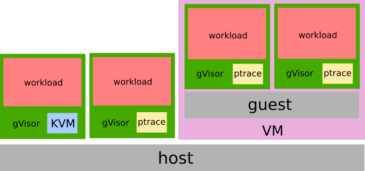

# Platform Guide

[TOC]

gVisor requires a platform to implement interception of syscalls, basic context
switching, and memory mapping functionality. Internally, gVisor uses an
abstraction sensibly called [Platform][platform]. A simplified version of this
interface looks like:

```golang
type Platform interface {
    NewAddressSpace() (AddressSpace, error)
    NewContext() Context
}

type Context interface {
    Switch(as AddressSpace, ac arch.Context) (..., error)
}

type AddressSpace interface {
    MapFile(addr hostarch.Addr, f File, fr FileRange, at hostarch.AccessType, ...) error
    Unmap(addr hostarch.Addr, length uint64)
}
```

There are a number of different ways to implement this interface that come with
various trade-offs, generally around performance and hardware requirements.

## Implementations

The choice of platform depends on the context in which `runsc` is executing. In
general, virtualized platforms may be limited to platforms that do not require
hardware virtualized support (since the hardware is already in use):



### ptrace

The ptrace platform uses [PTRACE_SYSEMU][ptrace] to execute user code without
allowing it to execute host system calls. This platform can run anywhere that
`ptrace` works (even VMs without nested virtualization), which is ubiquitous.

Unfortunately, the ptrace platform has high context switch overhead, so system
call-heavy applications may pay a [performance penalty](./performance.md).

### KVM

The KVM platform uses the kernel's [KVM][kvm] functionality to allow the Sentry
to act as both guest OS and VMM. The KVM platform can run on bare-metal or in a
VM with nested virtualization enabled. While there is no virtualized hardware
layer -- the sandbox retains a process model -- gVisor leverages virtualization
extensions available on modern processors in order to improve isolation and
performance of address space switches.

## Changing Platforms

See [Changing Platforms](../user_guide/platforms.md).

[kvm]: https://www.kernel.org/doc/Documentation/virtual/kvm/api.txt
[platform]: https://cs.opensource.google/gvisor/gvisor/+/release-20190304.1:pkg/sentry/platform/platform.go;l=33
[ptrace]: http://man7.org/linux/man-pages/man2/ptrace.2.html
