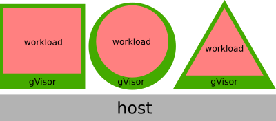

# Resource Model

[TOC]

The resource model for gVisor does not assume a fixed number of threads of
execution (i.e. vCPUs) or amount of physical memory. Where possible, decisions
about underlying physical resources are delegated to the host system, where
optimizations can be made with global information. This delegation allows the
sandbox to be highly dynamic in terms of resource usage: spanning a large number
of cores and large amount of memory when busy, and yielding those resources back
to the host when not.

In order words, the shape of the sandbox should closely track the shape of the
sandboxed process:

## Processes

Much like a Virtual Machine (VM), a gVisor sandbox appears as an opaque process
on the system. Processes within the sandbox do not manifest as processes on the
host system, and process-level interactions within the sandbox require entering
the sandbox (e.g. via a [Docker exec][exec]).

## Networking

The sandbox attaches a network endpoint to the system, but runs its own network
stack. All network resources, other than packets in flight on the host, exist
only inside the sandbox, bound by relevant resource limits.

You can interact with network endpoints exposed by the sandbox, just as you
would any other container, but network introspection similarly requires entering
the sandbox.

## Files

Files in the sandbox may be backed by different implementations. For host-native
files (where a file descriptor is available), the Gofer may return a file
descriptor to the Sentry via [SCM_RIGHTS][scmrights][^1].

These files may be read from and written to through standard system calls, and
also mapped into the associated application's address space. This allows the
same host memory to be shared across multiple sandboxes, although this mechanism
does not preclude the use of side-channels (see
[Security Model](./security.md)).

Note that some file systems exist only within the context of the sandbox. For
example, in many cases a `tmpfs` mount will be available at `/tmp` or
`/dev/shm`, which allocates memory directly from the sandbox memory file (see
below). Ultimately, these will be accounted against relevant limits in a similar
way as the host native case.

## Threads

The Sentry models individual task threads with [goroutines][goroutine]. As a
result, each task thread is a lightweight [green thread][greenthread], and may
not correspond to an underlying host thread.

However, application execution is modelled as a blocking system call with the
Sentry. This means that additional host threads may be created, *depending on
the number of active application threads*. In practice, a busy application will
converge on the number of active threads, and the host will be able to make
scheduling decisions about all application threads.

## Time

Time in the sandbox is provided by the Sentry, through its own [vDSO][vdso] and
time-keeping implementation. This is distinct from the host time, and no state
is shared with the host, although the time will be initialized with the host
clock.

The Sentry runs timers to note the passage of time, much like a kernel running
on hardware (though the timers are software timers, in this case). These timers
provide updates to the vDSO, the time returned through system calls, and the
time recorded for usage or limit tracking (e.g. [RLIMIT_CPU][rlimit]).

When all application threads are idle, the Sentry disables timers until an event
occurs that wakes either the Sentry or an application thread, similar to a
[tickless kernel][tickless]. This allows the Sentry to achieve near zero CPU
usage for idle applications.

## Memory

The Sentry implements its own memory management, including demand-paging and a
Sentry internal page cache for files that cannot be used natively. A single
[memfd][memfd] backs all application memory.

### Address spaces

The creation of address spaces is platform-specific. For some platforms,
additional "stub" processes may be created on the host in order to support
additional address spaces. These stubs are subject to various limits applied at
the sandbox level (e.g. PID limits).

### Physical memory

The host is able to manage physical memory using regular means (e.g. tracking
working sets, reclaiming and swapping under pressure). The Sentry lazily
populates host mappings for applications, and allow the host to demand-page
those regions, which is critical for the functioning of those mechanisms.

In order to avoid excessive overhead, the Sentry does not demand-page individual
pages. Instead, it selects appropriate regions based on heuristics. There is a
trade-off here: the Sentry is unable to trivially determine which pages are
active and which are not. Even if pages were individually faulted, the host may
select pages to be reclaimed or swapped without the Sentry's knowledge.

Therefore, memory usage statistics within the sandbox (e.g. via `proc`) are
approximations. The Sentry maintains an internal breakdown of memory usage, and
can collect accurate information but only through a relatively expensive API
call. In any case, it would likely be considered unwise to share precise
information about how the host is managing memory with the sandbox.

Finally, when an application marks a region of memory as no longer needed, for
example via a call to [madvise][madvise], the Sentry *releases this memory back
to the host*. There can be performance penalties for this, since it may be
cheaper in many cases to retain the memory and use it to satisfy some other
request. However, releasing it immediately to the host allows the host to more
effectively multiplex resources and apply an efficient global policy.

## Limits

All Sentry threads and Sentry memory are subject to a container cgroup. However,
application usage will not appear as anonymous memory usage, and will instead be
accounted to the `memfd`. All anonymous memory will correspond to Sentry usage,
and host memory charged to the container will work as standard.

The cgroups can be monitored for standard signals: pressure indicators,
threshold notifiers, etc. and can also be adjusted dynamically. Note that the
Sentry itself may listen for pressure signals in its containing cgroup, in order
to purge internal caches.

[goroutine]: https://tour.golang.org/concurrency/1
[greenthread]: https://en.wikipedia.org/wiki/Green_threads
[scheduler]: https://morsmachine.dk/go-scheduler
[vdso]: https://en.wikipedia.org/wiki/VDSO
[rlimit]: http://man7.org/linux/man-pages/man2/getrlimit.2.html
[tickless]: https://en.wikipedia.org/wiki/Tickless_kernel
[memfd]: http://man7.org/linux/man-pages/man2/memfd_create.2.html
[scmrights]: http://man7.org/linux/man-pages/man7/unix.7.html
[madvise]: http://man7.org/linux/man-pages/man2/madvise.2.html
[exec]: https://docs.docker.com/engine/reference/commandline/exec/
[^1]: Unless host networking is enabled, the Sentry is not able to create or
    open host file descriptors itself, it can only receive them in this way
    from the Gofer.
