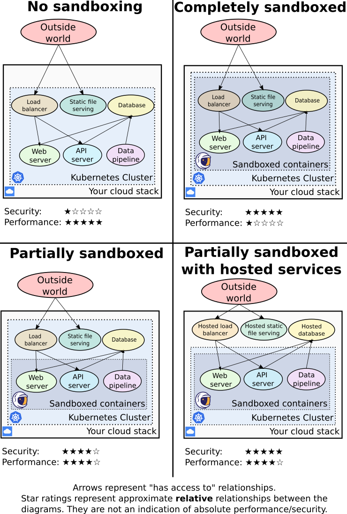

# Production guide

gVisor adds additional layers of defense to your containers, but comes with some
performance overhead. This page discusses **best practices** how and where to
integrate sandboxing within your production stack, to take full advantage of
gVisor's security benefits while minimizing overhead.

[TOC]

## The role of sandboxing in your production stack {#role}

At its core, gVisor sandboxes your containers, isolating them from the host's
Linux kernel and from each other. This is relevant to your production stack for
the following use-cases:

*   Hardening **externally-reachable endpoints**, such as user-facing load
    balancers, web servers, public API endpoints, etc.
*   Providing **defense-in-depth protection** for critical workloads handling
    sensitive information and/or under security compliance requirements, e.g.
    payment processing, sensitive data analysis pipelines.
*   Safely **operating a multi-tenancy environment** with security isolation,
    such as when operating an app platform for multiple third-party customers.
*   Providing additional features to your container stack, such as **intrusion
    detection** and **checkpoint save/restore**.
*   Safely **running untrusted code**, such as when running
    third-party/user-provided code, or for software forensics. **Note**: This
    guide is not appropriate for this use-case, and will instead focus on how to
    run an existing **trusted** stack with gVisor.

While gVisor is able to sandbox **any** application, it should generally not be
used to sandbox **every** application.

## Attack surface reduction {#attack-surface}

Because sandboxing comes with some performance overhead, you should first
investigate ways to **reduce your outside attack surface** (without such
overhead) as much as possible, prior to introducing sandboxing into your
production stack at all.

Consider running non-user-facing workloads in a separate virtual network, and
only run the user-facing entry points into this network in a sandbox. You can
also rely on network security with a service mesh like [Istio] to prevent
network traffic from arriving at sensitive endpoints, though note that such
solutions have [their own performance overhead][Istio overhead].

If using a Cloud provider, consider **using your provider's hosted application
solutions**, rather than rolling your own solution (sandboxed or not). This
simultaneously reduces your ops burden, the overall attack surface you are
personally responsible for, and most likely your overall Cloud provider charges.
For example, if using Google Cloud, consider:

*   [Cloud Spanner](https://cloud.google.com/spanner) as a database
*   [Cloud Load Balancing](https://cloud.google.com/load-balancing) as load
    balancer
*   [Cloud Storage](https://cloud.google.com/storage) for static file serving

These parts of your stack coincide with where sandboxing performance overhead is
most prevalent, so keeping them outside of your sandboxed perimeter provides
significant benefits.

## Security/performance trade-off {#security-vs-performance}

Once you've reduced your attack surface and have identified the components of
your production stack that may benefit from sandboxing, you still need to
determine whether the security benefits sandboxing provides are worth the
performance overhead.

gVisor protects your workload by intercepting system calls and emulating them in
userspace. This shields the host Linux kernel and the sandboxed application from
each other, **protecting against most Linux CVEs**, **container escape
vulnerabilities**, and making **remote privilege-escalation attacks** less
impactful. See [Security Model] for more details.

On the other hand, sandboxing has a **performance penalty**. This overhead is
multi-faceted and highly depends on the behavior of the workload being
sandboxed. As a general guideline, **I/O-heavy** (*e.g. databases*) and
**network-heavy** (*e.g. load balancers*) workloads will see degraded
performance, whereas **CPU-bound** workloads (*e.g. API servers, non-static web
servers, data pipelines*) will see minimal or no overhead. See
[Performance Guide] for more details and data.

Ultimately, the decision of whether to run each workload in a sandbox or not
comes down to a **balancing decision** between:

*   Sensitivity of your critical data
*   Applicable compliance obligations and regulations
*   Your organization's budget and PR risk tolerance
*   Your application's performance requirements
*   Overall security diligence

The following diagram summarizes the security/performance tradeoff for various
approaches of adding sandboxing to a typical stack.

## Configuring gVisor for optimal performance {#configure-for-performance}

Once you've identified the workloads that absolutely need sandboxing, it is
worth spending some time to configure gVisor for optimal performance.

### Choosing a platform {#configure-platform}

gVisor supports multiple low-level implementations called Platforms (See
[Platform architecture] for a detailed overview). Picking the right platform for
your environment is the **highest-impact performance decision**.

[GKE Sandbox] uses an optimized, custom platform which will provide good
performance with no tuning required.

When using gVisor outside of GKE Sandbox, we recommend **running gVisor on
bare-metal machines** (not VMs). In such a setup, use the KVM platform for best
performance.

If you absolutely must run gVisor in a virtual machine, we recommend using the
`ptrace` platform. This platform has the most flexibility, but its performance
will lag behind that of KVM and the GKE Sandbox platform.

<a class="button" href="/docs/user_guide/platforms/">Configure Platform
&raquo;</a>

### Optimizing I/O performance {#configure-io}

**File I/O is typically the most impacted performance characteristic** of a
gVisor-sandboxed workload. Because gVisor is a general-purpose sandbox, its
default configuration must support all possible I/O interaction patterns.
However, you can configure gVisor to use more aggressive caching policies where
it makes sense.

<a class="button" href="/docs/user_guide/filesystem/">Configure Filesystem
&raquo;</a>

### Optimizing network performance {#configure-network}

**Networking is typically the second most-impacted performance characteristic**
of a gVisor-sandboxed workload. gVisor implements its own network stack, which
is optimized for security over performance. If your application is semi-trusted
and network performance is paramount, you can optionally enable Network
Passthrough to use the host's (Linux's) network stack, rather than gVisor's own.

<a class="button" href="/docs/user_guide/networking/">Configure Networking
&raquo;</a>

[Istio]: https://istio.io/
[Istio overhead]: https://istio.io/latest/docs/ops/deployment/performance-and-scalability/
[Security Model]: /docs/architecture_guide/security/
[Performance Guide]: /docs/architecture_guide/performance/
[Platform architecture]: /docs/architecture_guide/platforms/
[Spectre]: https://en.wikipedia.org/wiki/Spectre_(security_vulnerability)
[Denial-of-Service attacks]: https://httpd.apache.org/docs/trunk/misc/security_tips.html
[GKE Sandbox]: https://cloud.google.com/kubernetes-engine/docs/concepts/sandbox-pods
