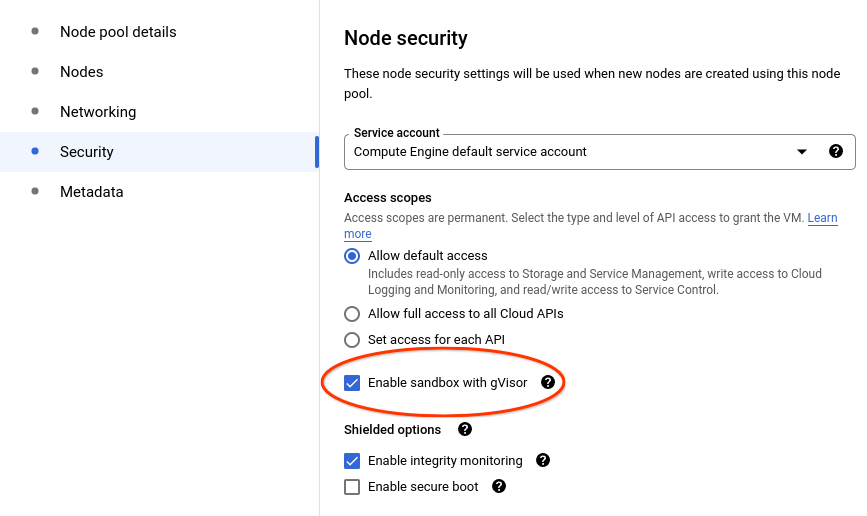

# WordPress with Kubernetes

This page shows you how to deploy a sample [WordPress][wordpress] site using
[GKE Sandbox][gke-sandbox].

### Before you begin

Take the following steps to enable the Kubernetes Engine API:

1.  Visit the [Kubernetes Engine page][project-selector] in the Google Cloud
    Platform Console.
1.  Create or select a project.

### Creating a node pool with gVisor enabled

Create a node pool inside your cluster with option `--sandbox type=gvisor` added
to the command, like below:

```shell
gcloud container node-pools create gvisor --cluster=${CLUSTER_NAME?} --sandbox type=gvisor --machine-type=e2-standard-2
```

If you prefer to use the console, select your cluster and select the **ADD NODE
POOL** button:


Then click on the **Security** tab on the left and select **Enable sandbox with
gVisor** option. Select other options as you like:



### Check that gVisor is enabled

The gvisor `RuntimeClass` is instantiated during node creation. You can check
for the existence of the gvisor `RuntimeClass` using the following command:

```shell
$ kubectl get runtimeclass/gvisor
NAME     HANDLER   AGE
gvisor   gvisor    1h
```

### Wordpress deployment

Now, let's deploy a WordPress site using GKE Sandbox. WordPress site requires
two pods: web server in the frontend, MySQL database in the backend. Both
applications use `PersistentVolumes` to store the site data. In addition, they
use secret store to share MySQL password between them.

> **Note**: This example uses gVisor to sandbox the frontend web server, but not
> the MySQL database backend. In a production setup, due to
> [the I/O overhead](../../architecture_guide/performance) imposed by gVisor,
> **it is not recommended to run your database in a sandbox**. The frontend is
> the critical component with the largest outside attack surface, where gVisor's
> security/performance trade-off makes the most sense. See the
> [Production guide] for more details.

First, let's download the deployment configuration files to add the runtime
class annotation to them:

```shell
curl -LO https://k8s.io/examples/application/wordpress/wordpress-deployment.yaml
curl -LO https://k8s.io/examples/application/wordpress/mysql-deployment.yaml
```

Add a **spec.template.spec.runtimeClassName** set to **gvisor** to both files,
as shown below:

**wordpress-deployment.yaml:**

```yaml
apiVersion: v1
kind: Service
metadata:
  name: wordpress
  labels:
    app: wordpress
spec:
  ports:
    - port: 80
  selector:
    app: wordpress
    tier: frontend
  type: LoadBalancer
---
apiVersion: v1
kind: PersistentVolumeClaim
metadata:
  name: wp-pv-claim
  labels:
    app: wordpress
spec:
  accessModes:
    - ReadWriteOnce
  resources:
    requests:
      storage: 20Gi
---
apiVersion: apps/v1
kind: Deployment
metadata:
  name: wordpress
  labels:
    app: wordpress
spec:
  selector:
    matchLabels:
      app: wordpress
      tier: frontend
  strategy:
    type: Recreate
  template:
    metadata:
      labels:
        app: wordpress
        tier: frontend
    spec:
      runtimeClassName: gvisor   # ADD THIS LINE
      containers:
      - image: wordpress:4.8-apache
        name: wordpress
        env:
        - name: WORDPRESS_DB_HOST
          value: wordpress-mysql
        - name: WORDPRESS_DB_PASSWORD
          valueFrom:
            secretKeyRef:
              name: mysql-pass
              key: password
        ports:
        - containerPort: 80
          name: wordpress
        volumeMounts:
        - name: wordpress-persistent-storage
          mountPath: /var/www/html
      volumes:
      - name: wordpress-persistent-storage
        persistentVolumeClaim:
          claimName: wp-pv-claim
```

**mysql-deployment.yaml:**

```yaml
apiVersion: v1
kind: Service
metadata:
  name: wordpress-mysql
  labels:
    app: wordpress
spec:
  ports:
    - port: 3306
  selector:
    app: wordpress
    tier: mysql
  clusterIP: None
---
apiVersion: v1
kind: PersistentVolumeClaim
metadata:
  name: mysql-pv-claim
  labels:
    app: wordpress
spec:
  accessModes:
    - ReadWriteOnce
  resources:
    requests:
      storage: 20Gi
---
apiVersion: apps/v1
kind: Deployment
metadata:
  name: wordpress-mysql
  labels:
    app: wordpress
spec:
  selector:
    matchLabels:
      app: wordpress
      tier: mysql
  strategy:
    type: Recreate
  template:
    metadata:
      labels:
        app: wordpress
        tier: mysql
    spec:
      #runtimeClassName: gvisor  # Uncomment this line if you want to sandbox the database.
      containers:
      - image: mysql:5.6
        name: mysql
        env:
        - name: MYSQL_ROOT_PASSWORD
          valueFrom:
            secretKeyRef:
              name: mysql-pass
              key: password
        ports:
        - containerPort: 3306
          name: mysql
        volumeMounts:
        - name: mysql-persistent-storage
          mountPath: /var/lib/mysql
      volumes:
      - name: mysql-persistent-storage
        persistentVolumeClaim:
          claimName: mysql-pv-claim
```

Note that apart from `runtimeClassName: gvisor`, nothing else about the
Deployment has is changed.

You are now ready to deploy the entire application. Just create a secret to
store MySQL's password and *apply* both deployments:

```shell
$ kubectl create secret generic mysql-pass --from-literal=password=${YOUR_SECRET_PASSWORD_HERE?}
$ kubectl apply -f mysql-deployment.yaml
$ kubectl apply -f wordpress-deployment.yaml
```

Wait for the deployments to be ready and an external IP to be assigned to the
Wordpress service:

```shell
$ watch kubectl get service wordpress
NAME        TYPE           CLUSTER-IP     EXTERNAL-IP      PORT(S)        AGE
wordpress   LoadBalancer   10.120.16.63   35.203.179.216   80:31025/TCP   1m
```

Now, copy the service's `EXTERNAL-IP` from above to your favorite browser to
view and configure your new WordPress site.

Congratulations! You have just deployed a WordPress site using GKE Sandbox.

### What's next

To learn more about GKE Sandbox and how to run your deployment securely, take a
look at the [documentation][gke-sandbox-docs].

Before taking this deployment to production, review the [Production guide].

[gke-sandbox-docs]: https://cloud.google.com/kubernetes-engine/docs/how-to/sandbox-pods
[gke-sandbox]: https://cloud.google.com/kubernetes-engine/sandbox/
[project-selector]: https://console.cloud.google.com/projectselector/kubernetes
[wordpress]: https://wordpress.com/
[Production guide]: /docs/user_guide/production/
