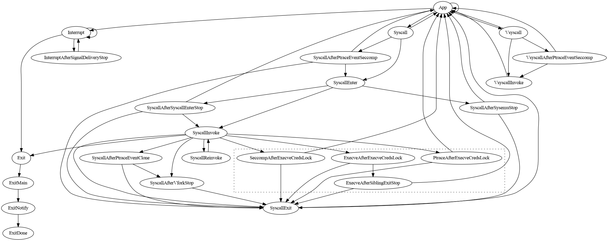

This package contains:

- A (partial) emulation of the "core Linux kernel", which governs task
  execution and scheduling, system call dispatch, and signal handling. See
  below for details.

- The top-level interface for the sentry's Linux kernel emulation in general,
  used by the `main` function of all versions of the sentry. This interface
  revolves around the `Env` type (defined in `kernel.go`).

# Background

In Linux, each schedulable context is referred to interchangeably as a "task" or
"thread". Tasks can be divided into userspace and kernel tasks. In the sentry,
scheduling is managed by the Go runtime, so each schedulable context is a
goroutine; only "userspace" (application) contexts are referred to as tasks, and
represented by Task objects. (From this point forward, "task" refers to the
sentry's notion of a task unless otherwise specified.)

At a high level, Linux application threads can be thought of as repeating a "run
loop":

- Some amount of application code is executed in userspace.

- A trap (explicit syscall invocation, hardware interrupt or exception, etc.)
  causes control flow to switch to the kernel.

- Some amount of kernel code is executed in kernelspace, e.g. to handle the
  cause of the trap.

- The kernel "returns from the trap" into application code.

Analogously, each task in the sentry is associated with a *task goroutine* that
executes that task's run loop (`Task.run` in `task_run.go`). However, the
sentry's task run loop differs in structure in order to support saving execution
state to, and resuming execution from, checkpoints.

While in kernelspace, a Linux thread can be descheduled (cease execution) in a
variety of ways:

- It can yield or be preempted, becoming temporarily descheduled but still
  runnable. At present, the sentry delegates scheduling of runnable threads to
  the Go runtime.

- It can exit, becoming permanently descheduled. The sentry's equivalent is
  returning from `Task.run`, terminating the task goroutine.

- It can enter interruptible sleep, a state in which it can be woken by a
  caller-defined wakeup or the receipt of a signal. In the sentry, interruptible
  sleep (which is ambiguously referred to as *blocking*) is implemented by
  making all events that can end blocking (including signal notifications)
  communicated via Go channels and using `select` to multiplex wakeup sources;
  see `task_block.go`.

- It can enter uninterruptible sleep, a state in which it can only be woken by a
  caller-defined wakeup. Killable sleep is a closely related variant in which
  the task can also be woken by SIGKILL. (These definitions also include Linux's
  "group-stopped" (`TASK_STOPPED`) and "ptrace-stopped" (`TASK_TRACED`) states.)

To maximize compatibility with Linux, sentry checkpointing appears as a spurious
signal-delivery interrupt on all tasks; interrupted system calls return `EINTR`
or are automatically restarted as usual. However, these semantics require that
uninterruptible and killable sleeps do not appear to be interrupted. In other
words, the state of the task, including its progress through the interrupted
operation, must be preserved by checkpointing. For many such sleeps, the wakeup
condition is application-controlled, making it infeasible to wait for the sleep
to end before checkpointing. Instead, we must support checkpointing progress
through sleeping operations.

# Implementation

We break the task's control flow graph into *states*, delimited by:

1. Points where uninterruptible and killable sleeps may occur. For example,
there exists a state boundary between signal dequeueing and signal delivery
because there may be an intervening ptrace signal-delivery-stop.

2. Points where sleep-induced branches may "rejoin" normal execution. For
example, the syscall exit state exists because it can be reached immediately
following a synchronous syscall, or after a task that is sleeping in `execve()`
or `vfork()` resumes execution.

3. Points containing large branches. This is strictly for organizational
purposes. For example, the state that processes interrupt-signaled conditions is
kept separate from the main "app" state to reduce the size of the latter.

4. `SyscallReinvoke`, which does not correspond to anything in Linux, and exists
solely to serve the autosave feature.

States before which a stop may occur are represented as implementations of the
`taskRunState` interface named `run(state)`, allowing them to be saved and
restored. States that cannot be immediately preceded by a stop are simply `Task`
methods named `do(state)`.

Conditions that can require task goroutines to cease execution for unknown
lengths of time are called *stops*. Stops are divided into *internal stops*,
which are stops whose start and end conditions are implemented within the
sentry, and *external stops*, which are stops whose start and end conditions are
not known to the sentry. Hence all uninterruptible and killable sleeps are
internal stops, and the existence of a pending checkpoint operation is an
external stop. Internal stops are reified into instances of the `TaskStop` type,
while external stops are merely counted. The task run loop alternates between
checking for stops and advancing the task's state. This allows checkpointing to
hold tasks in a stopped state while waiting for all tasks in the system to stop.
