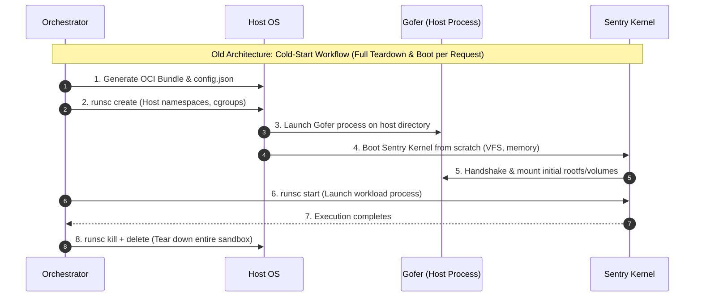
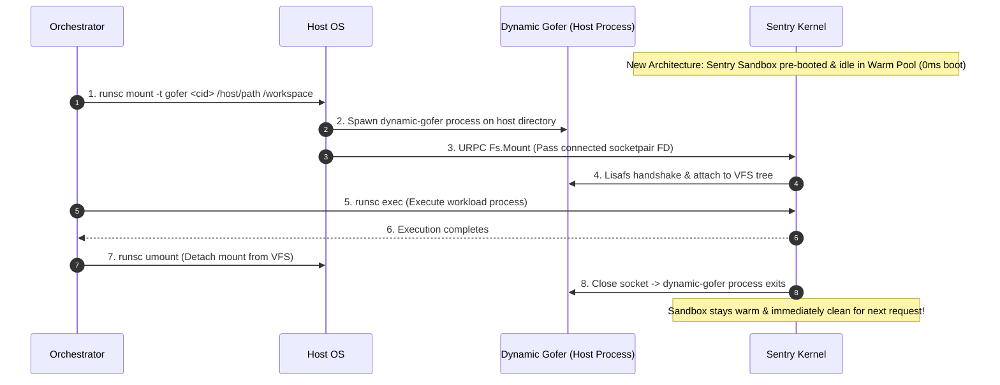

# Pre-Warmed gVisor Sandbox Pools with Dynamic Mounts

--------------------------------------------------------------------------------

## 1. Executive Summary

Sandboxing untrusted code in multi-tenant environments—such as Serverless
Function-as-a-Service (FaaS), AI Agent code interpreters, online code judges,
and CI/CD runners—demands both strong isolation and minimal execution latency.
While **gVisor (`runsc`)** delivers robust application-kernel separation,
traditional container runtimes require a full sandbox cold boot (host namespace
setup, Sentry kernel initialization, Gofer startup, and rootfs mounting) for
every incoming request.

To eliminate this cold-start penalty, we introduced **Dynamic Gofer Mount and
Unmount** in `runsc` (`runsc mount` and `runsc umount`). This capability unlocks
**Warm Sandbox Pools**: pre-booted gVisor sandboxes that dynamically attach and
detach isolated host directories on demand.

Our benchmark experiments evaluated across **1,000 consecutive runs per
platform** demonstrate massive, statistically robust performance gains:

*   **`systrap` Platform (Software Seccomp Trap):**

    *   **Setup Latency:** Slashed from **157.51 ms** to **22.90 ms** (**85.46%
        reduction / 6.88x faster**).
    *   **Total Turnaround:** **4.51x faster overall** (total request latency
        dropped from **197.20 ms** down to **43.70 ms**).
    *   **Predictability (Jitter):** Tail variance (StdDev σ) decreased by
        **5.0x** (from 55.71 ms down to 11.06 ms).

*   **`kvm` Platform (Hardware Virtualization):**

    *   **Setup Latency:** Slashed from **205.95 ms** to **17.88 ms** (**91.32%
        reduction / 11.52x faster**).
    *   **Total Turnaround:** **10.33x faster overall** (total request latency
        dropped from **338.28 ms** down to **32.74 ms**).
    *   **Median Response ($p_{50}$):** Dropped from **328.00 ms** down to
        **28.88 ms** (**11.36x faster**).

--------------------------------------------------------------------------------

## 2. Motivation & Real-World Use Cases

In modern cloud platforms, workloads are increasingly short-lived, interactive,
and multi-tenant:

*   **AI Agent Code Execution:** An LLM agent generates a script, executes it
    against a specific user workspace or dataset, and inspects the output.
*   **Serverless Functions (FaaS):** Microservices spin up on demand to process
    webhooks or event streams.
*   **Online Code Judges & CI/CD Runners:** Evaluating arbitrary untrusted
    submissions against isolated test files.

Each request requires:

1.  **Per-request custom data and resources:** Tenant A needs access to
    `/host/tenantA/dir`, while Tenant B needs `/host/tenantB/dir`.
2.  **Strict security isolation:** Untrusted workloads must be prevented from
    escaping into the host kernel or accessing neighboring tenant data.

### The Real Challenge: Crossing the Isolation Boundary

When designing warm sandbox pools, it is crucial to distinguish between
**in-memory temporary filesystems (`tmpfs`)** and **host directory sharing
(`gofer`)**:

*   **Why In-Memory (`tmpfs`) Mounting is Trivial:** In a warm pool, ephemeral
    in-memory storage (`/tmp`) is already a solved problem. A sandbox can simply
    be booted with `/tmp` pre-mounted, and the orchestrator can reset temporary
    files via `rm -rf /tmp/*` in microseconds (< 0.1 ms).
*   **The True Barrier: External Host File Sharing:** An untrusted guest process
    inside a gVisor sandbox **cannot reach into or mount host directories on its
    own**. The guest kernel boundary strictly prohibits host filesystem access.
*   **The Multi-Tenant Dilemma:** Before dynamic mounts, OCI container
    specifications (`config.json`) required static mount definitions at boot
    time. Because different requests require access to distinct host filesystems
    (such as tenant-specific workspaces, datasets, or input/output volumes), the
    orchestrator was forced to destroy the entire sandbox and cold-boot a new
    one just to change the mounted host path.
*   **The Dynamic Mount Solution:** With **Dynamic Gofer Mount (`runsc mount -t
    gofer`)**, the host orchestrator maintains a generic, persistent warm pool
    of running gVisor sandboxes. When an incoming request arrives, the
    orchestrator dynamically attaches the request's specific host directory,
    dataset, workspace, or stateful volume via a lightweight `dynamic-gofer`
    process. Once the task completes, the host directory is unmounted with
    `runsc umount`, and the pristine warm sandbox is immediately recycled back
    into the pool to serve subsequent requests with entirely different host
    filesystems.

--------------------------------------------------------------------------------

## 3. Architecture: Cold-Start vs. Warm Pool Dynamic Mounts

The fundamental difference lies in whether the sandbox kernel lifecycle is tied
to every individual request or kept persistently warm in a background pool.

### The Old Architecture: Cold-Start Bottleneck

Under the traditional workflow, every incoming request pays the full
initialization cost of host namespaces, Gofer processes, and Sentry kernel boot:



Steps 1 through 5 dominate the request lifecycle, forcing the orchestrator to
pay full cold-start setup overhead before a single line of user code executes.

--------------------------------------------------------------------------------

### The New Architecture: Warm Sandbox Pool with Dynamic Mounts

In the new architecture, Sentry is pre-booted and idle in a background pool. The
orchestrator only attaches the required host directory for the duration of the
request:



### 1-to-1 Architectural Comparison

| Lifecycle Phase        | Old Cold-Start          | New Warm Pool           |
:                        : Architecture            : Architecture            :
| :--------------------- | :---------------------- | :---------------------- |
| **Sandbox Boot**       | Boot Sentry kernel from | **0 ms** (Persistent    |
:                        : scratch (Heavy cold     : background pool)        :
:                        : boot)                   :                         :
| **Host Directory       | Static OCI bundle &     | `runsc mount -t gofer`  |
: Attach**               : container creation      : (Dynamic hot-plug)      :
| **Workload Exec**      | `runsc start`           | `runsc exec` (Warm      |
:                        :                         : runtime cache)          :
| **Teardown / Recycle** | `runsc kill` +          | `runsc umount` (Sandbox |
:                        : `delete` + full destroy : preserved)              :
| **Total Turnaround**   | Full cold-start cycle   | **Optimized warm pool   |
:                        :                         : turnaround**            :

--------------------------------------------------------------------------------

## 4. Comprehensive Benchmark Evaluation

To quantify the performance improvements, we evaluated both the **`systrap`**
and **`kvm`** platform backends across **1,000 consecutive iterations each**
using our dedicated benchmarking harness
([dynamic_mount_bench_test.go](https://github.com/google/gvisor/blob/master/runsc/container/dynamic_mount_bench_test.go)).

### Metric Definitions & Timing Boundaries

A sandboxed request lifecycle is partitioned into three sequential,
non-overlapping phases:

```
|<-------------------------------- Total Request Latency (T_total) -------------------------------->|
+------------------------------------+--------------------------------+-------------------------------+
|       Setup Phase (T_setup)        |    Execution Phase (T_exec)    |    Cleanup Phase (T_clean)    |
+------------------------------------+--------------------------------+-------------------------------+
```

1.  **Setup Latency (`T_setup`)**:
    *   **Cold Start**: Time from receiving a request until the sandbox is
        booted and ready: `T_setup (Cold) = time(OCI bundle generation) +
        time(runsc create) + time(runsc start)`
    *   **Warm Pool**: Time to dynamically attach the host directory into a
        running warm sandbox: `T_setup (Warm) = time(runsc mount)`
2.  **Execution Latency (`T_exec`)**:
    *   Wall-clock time to spawn the workload process inside the sandbox via
        `runsc exec`, run the payload, and wait for process exit.
3.  **Cleanup Latency (`T_clean`)**:
    *   **Cold Start**: Time to kill and delete the container (`runsc kill` +
        `delete` + bundle cleanup).
    *   **Warm Pool**: Time to detach the host directory via `runsc umount` and
        return the clean sandbox to the pool.
4.  **Total Request Turnaround (`T_total`)**:
    *   End-to-end wall-clock latency to serve one complete request: `T_total =
        T_setup + T_exec + T_clean`.

--------------------------------------------------------------------------------

### Platform Benchmark Comparison: `systrap` vs. `kvm` (1,000 Runs Each)

Evaluated across 1,000 consecutive request runs under both architectures for
each platform backend:

#### 1. `systrap` Platform (Software Seccomp Trap)

| Metric (Latency) | Cold Start (Gofer | Warm Pool +   | Improvement / Speedup |
:                  : Host Mount)       : Dynamic Mount :                       :
| :--------------- | :---------------- | :------------ | :-------------------- |
| **Setup Latency  | **157.51 ms**     | **22.90 ms**  | **85.46% reduction    |
: (T_setup Mean)** :                   :               : (6.88x faster)**      :
| **Setup Latency  | **146.13 ms**     | **21.12 ms**  | **6.92x faster**      |
: (T_setup p50 /   :                   :               :                       :
: Median)**        :                   :               :                       :
| **Execution      | 17.61 ms          | 9.06 ms       | 1.94x faster          |
: Latency (T_exec  :                   :               :                       :
: Mean)**          :                   :               :                       :
| **Total Request  | **197.20 ms**     | **43.70 ms**  | **4.51x faster        |
: Latency (T_total :                   :               : overall (77.84%       :
: Mean)**          :                   :               : drop)**               :
| **Total Request  | 182.72 ms         | 40.32 ms      | 4.53x faster          |
: Latency (T_total :                   :               :                       :
: p50)**           :                   :               :                       :
| **Total Request  | 268.40 ms         | 56.23 ms      | 4.77x faster          |
: Latency (T_total :                   :               :                       :
: p90)**           :                   :               :                       :
| **Total Request  | 298.67 ms         | 65.00 ms      | 4.59x faster          |
: Latency (T_total :                   :               :                       :
: p95)**           :                   :               :                       :
| **Total Request  | **371.48 ms**     | **83.33 ms**  | **4.46x faster**      |
: Latency (T_total :                   :               :                       :
: p99)**           :                   :               :                       :
| **Latency Jitter | 55.71 ms          | **11.06 ms**  | **5.0x more           |
: (StdDev σ)**     :                   :               : predictable**         :

--------------------------------------------------------------------------------

#### 2. `kvm` Platform (Hardware Virtualization)

| Metric (Latency) | Cold Start (Gofer | Warm Pool +   | Improvement / Speedup |
:                  : Host Mount)       : Dynamic Mount :                       :
| :--------------- | :---------------- | :------------ | :-------------------- |
| **Setup Latency  | **205.95 ms**     | **17.88 ms**  | **91.32% reduction    |
: (T_setup Mean)** :                   :               : (11.52x faster)**     :
| **Setup Latency  | **197.94 ms**     | **15.86 ms**  | **12.48x faster**     |
: (T_setup p50 /   :                   :               :                       :
: Median)**        :                   :               :                       :
| **Execution      | 5.56 ms           | 4.13 ms       | 1.34x faster          |
: Latency (T_exec  :                   :               :                       :
: Mean)**          :                   :               :                       :
| **Total Request  | **338.28 ms**     | **32.74 ms**  | **10.33x faster       |
: Latency (T_total :                   :               : overall (90.32%       :
: Mean)**          :                   :               : drop)**               :
| **Total Request  | 328.00 ms         | 28.88 ms      | 11.36x faster         |
: Latency (T_total :                   :               :                       :
: p50)**           :                   :               :                       :
| **Total Request  | 426.55 ms         | 42.01 ms      | 10.15x faster         |
: Latency (T_total :                   :               :                       :
: p90)**           :                   :               :                       :
| **Total Request  | 454.98 ms         | 46.14 ms      | 9.86x faster          |
: Latency (T_total :                   :               :                       :
: p95)**           :                   :               :                       :
| **Total Request  | **568.72 ms**     | **53.84 ms**  | **10.56x faster**     |
: Latency (T_total :                   :               :                       :
: p99)**           :                   :               :                       :
| **Latency Jitter | 69.83 ms          | **41.81 ms**  | **1.67x more          |
: (StdDev σ)**     :                   :               : predictable**         :

--------------------------------------------------------------------------------

### Comparative Benchmark Insights

1.  **Massive Setup Reduction across Both Platforms:**
    *   On `systrap`, setup overhead drops by **85.5%** (from 157.5 ms down to
        22.9 ms).
    *   On `kvm`, where cold sandbox creation is heavier due to VCPU and memory
        slot allocation, setup drops by **91.3%** (from 206.0 ms down to 17.9
        ms).
2.  **KVM Warm Pool Superpower (32.7 ms Total Turnaround / 28.9 ms Median):**
    *   While KVM carries a higher cold-boot penalty (338.3 ms total average),
        once the KVM Sentry is warm, hardware virtualization execution is
        blazing fast. Dynamic mounting delivers an astounding **10.33x
        end-to-end speedup** on KVM, bringing full request turnaround down to
        **32.74 ms** (with a median response of **28.88 ms**).
3.  **Exceptional Predictability:**
    *   Tail latency jitter (StdDev σ) drops to **11.06 ms** on `systrap`.
        Pre-warmed sandboxes eliminate OS scheduling and memory allocation
        spikes.

--------------------------------------------------------------------------------

## 5. Quickstart: CLI Usage

Using `runsc mount` and `runsc umount` in your orchestrator or scripts is
straightforward:

```bash
# Step 1: Pre-boot a generic warm sandbox container in the pool (e.g., on systrap or kvm)
runsc --platform=systrap run -d warm-sandbox-01

# Step 2: Dynamically attach a tenant's host directory
runsc mount -t gofer warm-sandbox-01 /home/userA/project /workspace

# Step 3: Execute the workload inside the mounted directory
runsc exec warm-sandbox-01 /bin/sh -c "python3 /workspace/main.py"

# Step 4: Dynamically unmount the directory when finished
runsc umount warm-sandbox-01 /workspace

# The sandbox is immediately clean and ready for Tenant B!
```

--------------------------------------------------------------------------------

## 6. Future Work: Supercharging gVisor Warm Pools

Dynamic filesystem mounting is a foundational milestone. Several exciting
opportunities exist to make gVisor warm pools even faster, safer, and more
flexible:

### 1. Ephemeral Rootfs Overlay Reset (`runsc reset`)

When untrusted code runs, it may modify rootfs state or create temporary files.

*   **Proposed Feature:** A fast sandbox reset command (`runsc reset`) that uses
    copy-on-write (CoW) overlay branches. On reset, Sentry instantly discards
    the upper overlay layer in sub-millisecond time, reverting rootfs and memory
    to a pristine baseline without rebooting Sentry.

### 2. Task-Scoped Process & Cgroup Cleanup (`runsc exec --cleanup`)

Workloads might spawn background daemon processes or orphan threads.

*   **Proposed Feature:** Sentry-managed sub-cgroups / PID namespaces for each
    `runsc exec` session. When the exec session finishes, Sentry automatically
    terminates all lingering descendant processes belonging to that session
    before returning the sandbox to the pool.

### 3. Dynamic Network Namespace & Socket Injection (`runsc net-attach`)

Just as different requests require different filesystems, they often require
different network isolation profiles (e.g. Tenant A needs egress internet via
proxy, Tenant B requires `--network=none`).

*   **Proposed Feature:** Dynamically attaching and detaching network interfaces
    (veth pairs, TAP devices, or proxy FDs) into Sentry's network stack on
    demand.

### 4. Persistent Multi-Tenant Gofer Daemon Pool

Currently, `runsc mount -t gofer` spawns a new `dynamic-gofer` process per
mount.

*   **Proposed Feature:** A shared, multi-tenant Gofer daemon that multiplexes
    host directories across pre-connected control channels to further minimize
    dynamic host mount latency.

### 5. Pre-Forked Sentry Templates (CoW Sandbox Cloning)

For workloads requiring heavy runtime initialization (e.g., Python with PyTorch
or Node.js pre-loaded into memory).

*   **Proposed Feature:** Booting a "Template Sentry" with pre-loaded runtime
    libraries, and using memory snapshotting or host CoW cloning to fork new
    warm sandbox instances in sub-millisecond time.

--------------------------------------------------------------------------------

## 7. Conclusion

Dynamic filesystem mounting in `runsc` eliminates the historic tradeoff between
gVisor's strong isolation and low-latency startup requirements in serverless and
AI agent platforms. Whether deploying on software interception (`systrap`) or
hardware virtualization (`kvm`), warm sandbox pools with dynamic host mounts
deliver **up to 11.52x faster sandbox setup** and **up to 10.33x faster
end-to-end request turnaround**.
